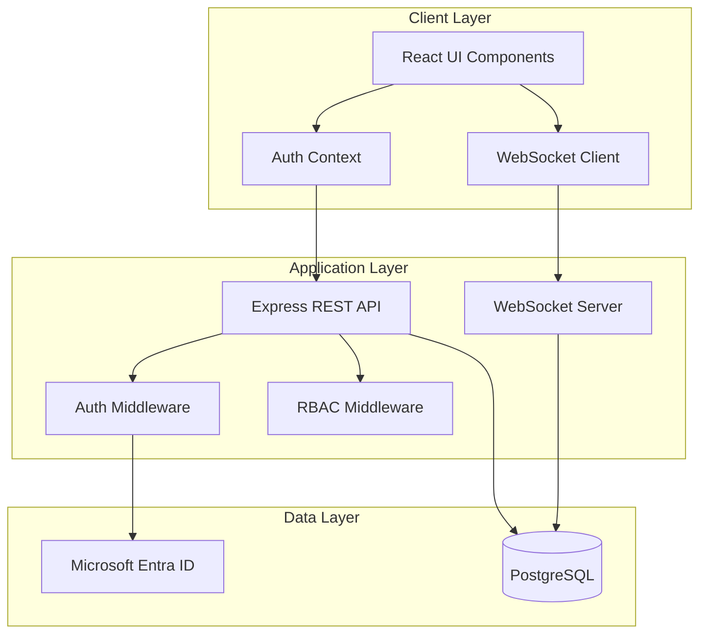
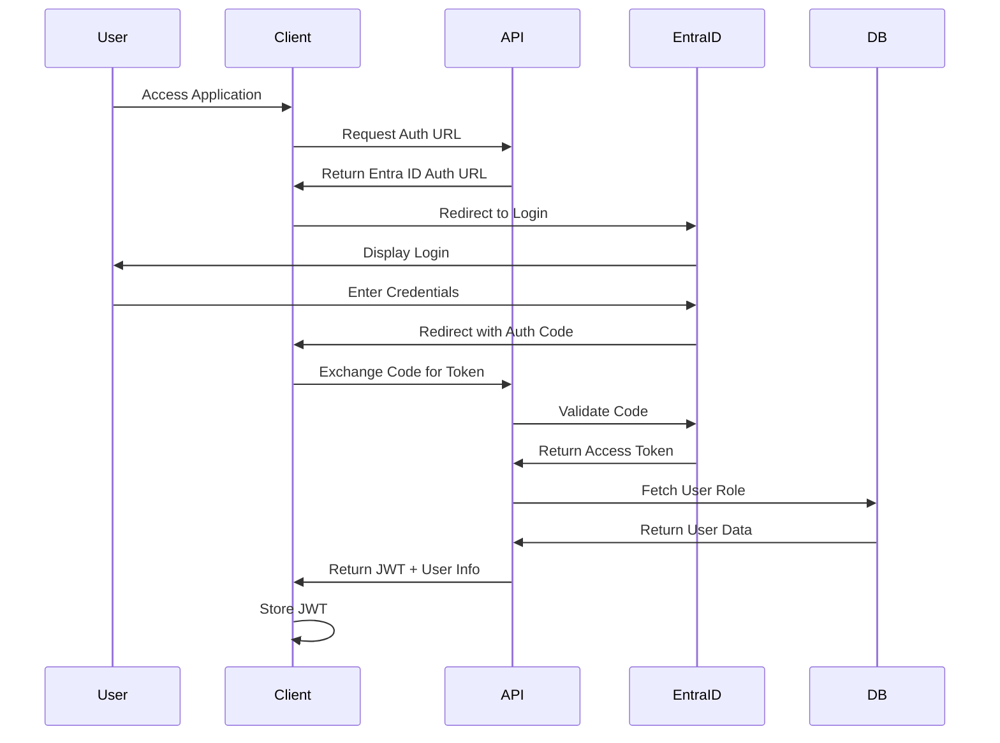
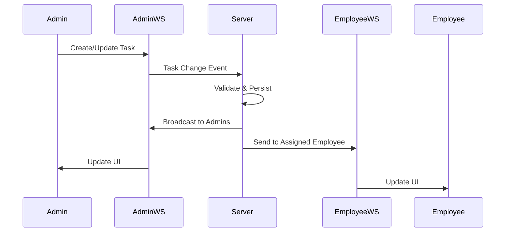

# Design Document: Decode Age Task Manager

## Overview

The Decode Age Task Manager is a web-based application that provides role-based task management with Microsoft Entra ID authentication. The system enables administrators to create, assign, and monitor tasks while allowing employees to view and complete their assigned work. The application features real-time updates, responsive design, and branding consistent with Decode Age's health and supplement company identity.

### Key Design Decisions

1. **Authentication Strategy**: Microsoft Entra ID (formerly Azure AD) free tier using OAuth 2.0 authorization code flow with PKCE for secure authentication
2. **Real-Time Architecture**: WebSocket connections for bidirectional real-time updates with fallback to Server-Sent Events (SSE)
3. **Frontend Framework**: React with TypeScript for type safety and component reusability
4. **Backend Framework**: Node.js with Express for REST API and WebSocket server
5. **Database**: PostgreSQL for reliable ACID-compliant data persistence
6. **State Management**: React Context API with custom hooks for global state and real-time synchronization

## Architecture

### System Architecture

The system follows a three-tier architecture:



### Authentication Flow



### Real-Time Update Flow



## Components and Interfaces

### Frontend Components

#### 1. Authentication Components

**LoginPage**
- Initiates Microsoft Entra ID OAuth flow
- Handles callback and token exchange
- Redirects to dashboard on success

**AuthContext**
```typescript
interface AuthContext {
  user: User | null;
  role: 'admin' | 'employee' | null;
  isAuthenticated: boolean;
  login: () => Promise<void>;
  logout: () => void;
  refreshToken: () => Promise<void>;
}
```

**ProtectedRoute**
- Wraps routes requiring authentication
- Redirects to login if unauthenticated
- Enforces role-based access control

#### 2. Dashboard Components

**AdminDashboard**
- Displays all tasks with filtering capabilities
- Shows task creation form
- Provides user management interface
- Displays completion statistics

**EmployeeDashboard**
- Displays tasks assigned to current user
- Sorted by deadline (nearest first)
- Shows completion status
- Provides task completion controls

**TaskList**
```typescript
interface TaskListProps {
  tasks: Task[];
  onTaskComplete?: (taskId: string) => void;
  onTaskEdit?: (taskId: string) => void;
  onTaskDelete?: (taskId: string) => void;
  isAdmin: boolean;
}
```

**TaskCard**
```typescript
interface TaskCardProps {
  task: Task;
  onComplete?: () => void;
  onEdit?: () => void;
  isAdmin: boolean;
}
```

#### 3. Task Management Components

**TaskCreationForm**
- Input fields for description (1-500 chars)
- Date picker for deadline (future dates only)
- Employee selector for assignment
- Validation and error display

**TaskFilterPanel**
- Filter by employee (admin only)
- Filter by status (complete/incomplete)
- Filter by deadline range
- Clear filters button

#### 4. User Management Components

**UserManagementPanel** (Admin only)
- List of all employees with email
- Add employee form
- Remove employee button with confirmation
- Prevents removal of last admin

#### 5. Real-Time Components

**WebSocketProvider**
```typescript
interface WebSocketContext {
  connected: boolean;
  subscribe: (event: string, handler: Function) => void;
  unsubscribe: (event: string, handler: Function) => void;
  emit: (event: string, data: any) => void;
}
```

**ConnectionIndicator**
- Displays connection status
- Shows reconnection attempts
- Alerts user on connection loss

### Backend Components

#### 1. API Endpoints

**Authentication Endpoints**
```
GET  /api/auth/login          - Get Entra ID auth URL
GET  /api/auth/callback       - Handle OAuth callback
POST /api/auth/refresh        - Refresh access token
POST /api/auth/logout         - Invalidate session
```

**Task Endpoints**
```
GET    /api/tasks             - Get tasks (filtered by role)
POST   /api/tasks             - Create task (admin only)
PUT    /api/tasks/:id         - Update task (admin only)
DELETE /api/tasks/:id         - Delete task (admin only)
PATCH  /api/tasks/:id/complete - Toggle completion status
PATCH  /api/tasks/:id/assign  - Assign task to employee (admin only)
```

**User Endpoints**
```
GET    /api/users             - Get all users (admin only)
POST   /api/users             - Add employee (admin only)
DELETE /api/users/:id         - Remove employee (admin only)
GET    /api/users/me          - Get current user info
```

#### 2. Middleware

**authMiddleware**
```typescript
interface AuthMiddleware {
  verifyToken: (req, res, next) => void;
  extractUser: (req, res, next) => void;
}
```

**rbacMiddleware**
```typescript
interface RBACMiddleware {
  requireAdmin: (req, res, next) => void;
  requireAuth: (req, res, next) => void;
  logUnauthorized: (req, res, next) => void;
}
```

**validationMiddleware**
```typescript
interface ValidationMiddleware {
  validateTaskCreation: (req, res, next) => void;
  validateTaskUpdate: (req, res, next) => void;
  validateUserCreation: (req, res, next) => void;
}
```

#### 3. Services

**AuthService**
```typescript
interface AuthService {
  getAuthUrl: () => string;
  exchangeCodeForToken: (code: string) => Promise<TokenResponse>;
  validateToken: (token: string) => Promise<UserInfo>;
  refreshAccessToken: (refreshToken: string) => Promise<TokenResponse>;
}
```

**TaskService**
```typescript
interface TaskService {
  createTask: (task: CreateTaskDTO) => Promise<Task>;
  updateTask: (id: string, updates: UpdateTaskDTO) => Promise<Task>;
  deleteTask: (id: string) => Promise<void>;
  getTasksForUser: (userId: string, role: string) => Promise<Task[]>;
  assignTask: (taskId: string, employeeId: string) => Promise<Task>;
  toggleCompletion: (taskId: string, userId: string) => Promise<Task>;
  unassignTasksForEmployee: (employeeId: string) => Promise<void>;
}
```

**UserService**
```typescript
interface UserService {
  createUser: (email: string, role: string) => Promise<User>;
  deleteUser: (userId: string) => Promise<void>;
  getUserById: (userId: string) => Promise<User>;
  getAllUsers: () => Promise<User[]>;
  updateUserRole: (userId: string, role: string) => Promise<User>;
  isLastAdmin: (userId: string) => Promise<boolean>;
}
```

**WebSocketService**
```typescript
interface WebSocketService {
  broadcastToAdmins: (event: string, data: any) => void;
  sendToUser: (userId: string, event: string, data: any) => void;
  broadcastToAll: (event: string, data: any) => void;
  handleConnection: (socket: WebSocket, userId: string) => void;
  handleDisconnection: (socket: WebSocket) => void;
}
```

## Data Models

### User Model

```typescript
interface User {
  id: string;                    // UUID
  email: string;                 // From Entra ID
  role: 'admin' | 'employee';    // Role assignment
  entraId: string;               // Microsoft Entra ID user ID
  createdAt: Date;
  updatedAt: Date;
}
```

**Database Schema (PostgreSQL)**
```sql
CREATE TABLE users (
  id UUID PRIMARY KEY DEFAULT gen_random_uuid(),
  email VARCHAR(255) UNIQUE NOT NULL,
  role VARCHAR(20) NOT NULL CHECK (role IN ('admin', 'employee')),
  entra_id VARCHAR(255) UNIQUE NOT NULL,
  created_at TIMESTAMP DEFAULT CURRENT_TIMESTAMP,
  updated_at TIMESTAMP DEFAULT CURRENT_TIMESTAMP
);

CREATE INDEX idx_users_email ON users(email);
CREATE INDEX idx_users_entra_id ON users(entra_id);
CREATE INDEX idx_users_role ON users(role);
```

### Task Model

```typescript
interface Task {
  id: string;                    // UUID
  description: string;           // 1-500 characters
  deadline: Date;                // Future date
  assignedTo: string | null;     // User ID or null if unassigned
  createdBy: string;             // Admin user ID
  status: 'incomplete' | 'complete';
  completedAt: Date | null;      // Timestamp when marked complete
  createdAt: Date;
  updatedAt: Date;
}
```

**Database Schema (PostgreSQL)**
```sql
CREATE TABLE tasks (
  id UUID PRIMARY KEY DEFAULT gen_random_uuid(),
  description VARCHAR(500) NOT NULL,
  deadline TIMESTAMP NOT NULL,
  assigned_to UUID REFERENCES users(id) ON DELETE SET NULL,
  created_by UUID NOT NULL REFERENCES users(id),
  status VARCHAR(20) NOT NULL DEFAULT 'incomplete' CHECK (status IN ('incomplete', 'complete')),
  completed_at TIMESTAMP,
  created_at TIMESTAMP DEFAULT CURRENT_TIMESTAMP,
  updated_at TIMESTAMP DEFAULT CURRENT_TIMESTAMP
);

CREATE INDEX idx_tasks_assigned_to ON tasks(assigned_to);
CREATE INDEX idx_tasks_status ON tasks(status);
CREATE INDEX idx_tasks_deadline ON tasks(deadline);
CREATE INDEX idx_tasks_created_by ON tasks(created_by);
```

### Session Model

```typescript
interface Session {
  id: string;                    // UUID
  userId: string;                // User ID
  accessToken: string;           // Entra ID access token
  refreshToken: string;          // Entra ID refresh token
  expiresAt: Date;               // Token expiration
  createdAt: Date;
}
```

**Database Schema (PostgreSQL)**
```sql
CREATE TABLE sessions (
  id UUID PRIMARY KEY DEFAULT gen_random_uuid(),
  user_id UUID NOT NULL REFERENCES users(id) ON DELETE CASCADE,
  access_token TEXT NOT NULL,
  refresh_token TEXT NOT NULL,
  expires_at TIMESTAMP NOT NULL,
  created_at TIMESTAMP DEFAULT CURRENT_TIMESTAMP
);

CREATE INDEX idx_sessions_user_id ON sessions(user_id);
CREATE INDEX idx_sessions_expires_at ON sessions(expires_at);
```

### DTOs (Data Transfer Objects)

```typescript
interface CreateTaskDTO {
  description: string;           // 1-500 chars
  deadline: string;              // ISO date string
  assignedTo?: string;           // Optional user ID
}

interface UpdateTaskDTO {
  description?: string;
  deadline?: string;
  assignedTo?: string;
  status?: 'incomplete' | 'complete';
}

interface CreateUserDTO {
  email: string;
  role: 'admin' | 'employee';
  entraId: string;
}

interface TokenResponse {
  accessToken: string;
  refreshToken: string;
  expiresIn: number;
}

interface UserInfo {
  id: string;
  email: string;
  role: 'admin' | 'employee';
}
```


## Correctness Properties

*A property is a characteristic or behavior that should hold true across all valid executions of a system-essentially, a formal statement about what the system should do. Properties serve as the bridge between human-readable specifications and machine-verifiable correctness guarantees.*

### Property 1: Successful Authentication Retrieves User Role

*For any* successful authentication with Microsoft Entra ID, the system should retrieve and return the user's role from the User_Store.

**Validates: Requirements 1.2, 11.3**

### Property 2: Failed Authentication Denies Access

*For any* authentication failure scenario, the system should display an error message and prevent access to the application.

**Validates: Requirements 1.3**

### Property 3: Expired Sessions Redirect to Login

*For any* user session that has expired, attempting to access the application should redirect to the login page.

**Validates: Requirements 1.5**

### Property 4: Task Creation Persists with Correct Fields

*For any* valid task data (description, deadline, optional assignee), creating a task should result in the task being stored in Task_Store with all specified fields and an initial status of 'incomplete'.

**Validates: Requirements 2.1, 12.1**

### Property 5: Task Description Length Validation

*For any* string, the system should accept it as a task description if and only if its length is between 1 and 500 characters inclusive.

**Validates: Requirements 2.2**

### Property 6: Deadline Must Be Future Date

*For any* date value, the system should accept it as a task deadline if and only if it represents a future date and time.

**Validates: Requirements 2.3**

### Property 7: Task Creation Success Confirmation

*For any* successful task creation, the system should display a success confirmation message to the user.

**Validates: Requirements 2.4**

### Property 8: Task Creation Failure Error Message

*For any* failed task creation attempt, the system should display a descriptive error message explaining the failure reason.

**Validates: Requirements 2.5**

### Property 9: Task Assignment Updates Store

*For any* task and employee, when an admin assigns the task to the employee, the task record in Task_Store should be updated with the employee's ID in the assignedTo field.

**Validates: Requirements 3.1**

### Property 10: Task Reassignment Allowed

*For any* task, the system should allow reassigning it to different employees multiple times, with each reassignment updating the assignedTo field.

**Validates: Requirements 3.4**

### Property 11: Employee Removal Unassigns Tasks

*For any* employee with assigned tasks, removing the employee from User_Store should set the assignedTo field to null for all tasks assigned to that employee.

**Validates: Requirements 3.5, 7.4**

### Property 12: Employees See Only Their Tasks

*For any* employee user, accessing the dashboard should display only tasks where the assignedTo field matches that employee's ID.

**Validates: Requirements 4.1**

### Property 13: Task Display Contains Required Fields

*For any* task displayed in the UI, the rendered output should contain the task's description, deadline, and completion status.

**Validates: Requirements 4.2, 6.4**

### Property 14: Tasks Sorted By Deadline

*For any* list of tasks displayed to a user, the tasks should be sorted with the nearest deadline first (ascending order by deadline).

**Validates: Requirements 4.3**

### Property 15: Real-Time Task Updates Propagate

*For any* task change (creation, assignment, status update), all connected dashboard instances that should display that task should receive the update within 2 seconds.

**Validates: Requirements 3.3, 4.5, 5.3, 6.5, 10.1, 10.2, 10.3**

### Property 16: Task Completion Updates Status and Timestamp

*For any* task marked as complete, the system should update the task's status to 'complete' and record a completion timestamp in the completedAt field.

**Validates: Requirements 5.1, 5.2, 5.4**

### Property 17: Marking Incomplete Removes Timestamp

*For any* completed task marked as incomplete, the system should update the status to 'incomplete' and set the completedAt field to null.

**Validates: Requirements 5.5**

### Property 18: Admins See All Tasks

*For any* admin user, accessing the dashboard should display all tasks in the system with their assignee, status, and deadline information.

**Validates: Requirements 6.1**

### Property 19: Completion Percentage Calculation

*For any* set of tasks, the displayed completion percentage should equal (number of completed tasks / total number of tasks) × 100, rounded to the nearest integer.

**Validates: Requirements 6.2**

### Property 20: Task Filtering Works Correctly

*For any* filter criteria (employee, status, or deadline range), the filtered task list should contain only tasks that match the specified criteria.

**Validates: Requirements 6.3**

### Property 21: Employee Addition Persists with Role

*For any* valid employee data (email, Entra ID), adding an employee should store the user in User_Store with the role set to 'employee'.

**Validates: Requirements 7.1, 12.2**

### Property 22: Employee Removal Deletes from Store

*For any* employee user, removing the employee should delete the user record from User_Store.

**Validates: Requirements 7.2**

### Property 23: Employee List Displays All with Emails

*For any* set of employees in User_Store, the employee list UI should display all employees with their email addresses visible.

**Validates: Requirements 7.3**

### Property 24: Last Admin Cannot Be Removed

*For any* admin user, if that user is the only admin in the system, attempting to remove them should be prevented and return an error.

**Validates: Requirements 7.5**

### Property 25: Responsive Layout Adapts to Screen Width

*For any* screen width, the UI should apply the appropriate layout: mobile layout for widths < 768px, tablet layout for widths 768-1024px, and desktop layout for widths > 1024px.

**Validates: Requirements 9.1, 9.2, 9.3**

### Property 26: Touch Targets Meet Minimum Size on Mobile

*For any* interactive UI element on mobile devices (screen width < 768px), the element should have a minimum touch target size of 44x44 pixels.

**Validates: Requirements 9.5**

### Property 27: Real-Time Connection Persists During Activity

*For any* active user session, the WebSocket connection should remain open and connected while the user is actively using the application.

**Validates: Requirements 10.4**

### Property 28: Connection Loss Displays Indicator

*For any* WebSocket connection loss, the UI should display a connection status indicator informing the user of the disconnection.

**Validates: Requirements 10.5**

### Property 29: Employees Cannot Access Admin Features

*For any* employee user and any admin-only feature, attempting to access that feature should be denied and display an error message.

**Validates: Requirements 11.1**

### Property 30: Admins Have Access to All Features

*For any* admin user, all administrative functions (task creation, assignment, user management) should be enabled and accessible.

**Validates: Requirements 11.2**

### Property 31: Role Changes Apply on Next Login

*For any* user whose role is changed in User_Store, the next authentication should retrieve and apply the updated role, changing the user's permissions accordingly.

**Validates: Requirements 11.4**

### Property 32: Unauthorized Access Attempts Are Logged

*For any* unauthorized access attempt to an admin feature by an employee, the system should create a log entry recording the attempt.

**Validates: Requirements 11.5**

### Property 33: Data Survives System Restart

*For any* tasks and users in the system, restarting the Task_Manager should result in all data being restored from storage with no data loss.

**Validates: Requirements 12.3**

### Property 34: Concurrent Updates Maintain Consistency

*For any* two concurrent update operations on the same task or user, the system should handle both updates without data corruption, with the final state reflecting a valid sequence of operations.

**Validates: Requirements 12.4**

### Property 35: Database Failures Display Errors and Maintain Integrity

*For any* database operation failure, the system should display an error message to the user and ensure that no partial or corrupted data is persisted.

**Validates: Requirements 12.5**

## Error Handling

### Authentication Errors

**Entra ID Connection Failures**
- Retry logic with exponential backoff (3 attempts)
- Display user-friendly error message
- Log detailed error for debugging
- Fallback to maintenance mode if Entra ID is unreachable

**Token Validation Failures**
- Clear invalid tokens from client storage
- Redirect to login page
- Log security event for monitoring

**Session Expiration**
- Detect expired tokens before API calls
- Attempt automatic token refresh using refresh token
- Redirect to login if refresh fails
- Preserve user's current page for post-login redirect

### Task Operation Errors

**Validation Errors**
- Return 400 Bad Request with specific field errors
- Display inline validation messages in UI
- Highlight invalid fields
- Prevent form submission until valid

**Assignment Errors**
- Verify employee exists before assignment
- Handle employee deletion during assignment
- Display error if employee not found
- Rollback assignment on failure

**Deadline Validation**
- Reject past dates with clear error message
- Handle timezone differences correctly
- Validate date format before processing

### Real-Time Connection Errors

**WebSocket Connection Failures**
- Implement automatic reconnection with exponential backoff
- Maximum 5 reconnection attempts
- Display connection status indicator
- Fall back to polling if WebSocket unavailable
- Queue updates during disconnection and sync on reconnect

**Message Delivery Failures**
- Implement message acknowledgment system
- Retry failed messages up to 3 times
- Log undeliverable messages
- Notify user of sync issues

### Database Errors

**Connection Failures**
- Implement connection pooling with health checks
- Retry failed queries (3 attempts)
- Return 503 Service Unavailable to client
- Display maintenance message to users

**Constraint Violations**
- Catch unique constraint violations (duplicate emails)
- Catch foreign key violations (invalid references)
- Return 409 Conflict with descriptive message
- Prevent data corruption

**Transaction Failures**
- Wrap critical operations in transactions
- Rollback on any error
- Log transaction failures
- Maintain data consistency

### User Management Errors

**Last Admin Protection**
- Check admin count before deletion
- Return 403 Forbidden if last admin
- Display clear error message
- Suggest promoting another user first

**Employee Deletion with Tasks**
- Unassign all tasks in transaction
- Verify unassignment succeeded
- Rollback if any step fails
- Log deletion event

### Rate Limiting and Abuse Prevention

**API Rate Limits**
- 100 requests per minute per user
- 1000 requests per hour per user
- Return 429 Too Many Requests
- Include Retry-After header

**Failed Login Attempts**
- Track failed attempts per email
- Implement temporary lockout after 5 failures
- 15-minute lockout period
- Log suspicious activity

## Testing Strategy

### Unit Testing

The system will use **Jest** for unit testing with the following focus areas:

**Component Testing (React Testing Library)**
- Test individual UI components in isolation
- Verify correct rendering with different props
- Test user interactions (clicks, form submissions)
- Test conditional rendering based on role
- Mock external dependencies (API calls, WebSocket)

**Service Layer Testing**
- Test AuthService token exchange and validation
- Test TaskService CRUD operations
- Test UserService user management
- Test WebSocketService message broadcasting
- Mock database and external API calls

**Middleware Testing**
- Test authentication middleware with valid/invalid tokens
- Test RBAC middleware with different roles
- Test validation middleware with valid/invalid inputs
- Verify proper error responses

**Utility Function Testing**
- Test date validation functions
- Test string validation (length, format)
- Test calculation functions (completion percentage)
- Test sorting and filtering logic

**Example Unit Tests**
- Empty task list displays "no tasks" message (Requirement 4.4)
- Decode Age logo is displayed in header (Requirement 8.2)
- Employee list shows all employees when assigning tasks (Requirement 3.2)
- Unauthenticated access redirects to login (Requirement 1.1)

### Property-Based Testing

The system will use **fast-check** (JavaScript/TypeScript property-based testing library) for property-based testing with a minimum of 100 iterations per test.

**Configuration**
```typescript
import fc from 'fast-check';

// Minimum 100 iterations per property test
const propertyTestConfig = { numRuns: 100 };
```

**Test Tagging Format**
Each property test must include a comment tag:
```typescript
// Feature: decode-age-task-manager, Property 5: Task Description Length Validation
```

**Property Test Implementation Guidelines**

1. **Data Generators**: Create custom generators for domain objects
   - User generator (admin/employee roles)
   - Task generator (valid descriptions, deadlines)
   - Invalid data generators (past dates, invalid lengths)

2. **Test Structure**: Each property test should:
   - Generate random valid inputs
   - Execute the operation
   - Assert the property holds
   - Clean up test data

3. **Property Test Coverage**: Each correctness property (1-35) must have exactly one corresponding property-based test

**Example Property Test Structure**
```typescript
// Feature: decode-age-task-manager, Property 5: Task Description Length Validation
describe('Task Description Validation', () => {
  it('accepts descriptions between 1-500 chars', () => {
    fc.assert(
      fc.property(
        fc.string({ minLength: 1, maxLength: 500 }),
        (description) => {
          const result = validateTaskDescription(description);
          expect(result.isValid).toBe(true);
        }
      ),
      propertyTestConfig
    );
  });

  it('rejects descriptions outside 1-500 char range', () => {
    fc.assert(
      fc.property(
        fc.oneof(
          fc.string({ maxLength: 0 }),
          fc.string({ minLength: 501 })
        ),
        (description) => {
          const result = validateTaskDescription(description);
          expect(result.isValid).toBe(false);
        }
      ),
      propertyTestConfig
    );
  });
});
```

### Integration Testing

**API Integration Tests**
- Test complete request/response cycles
- Test authentication flow end-to-end
- Test task CRUD operations through API
- Test real-time WebSocket communication
- Use test database for isolation

**Database Integration Tests**
- Test actual database operations
- Test transaction rollback scenarios
- Test concurrent update handling
- Test foreign key constraints
- Use test database with migrations

### End-to-End Testing

**Cypress for E2E Testing**
- Test complete user workflows
- Test admin task creation and assignment flow
- Test employee task viewing and completion flow
- Test real-time updates across multiple browser instances
- Test responsive design at different viewports
- Test authentication flow with mock Entra ID

### Performance Testing

**Load Testing**
- Test WebSocket connection scalability (100+ concurrent users)
- Test database query performance under load
- Test real-time update latency
- Verify 2-second update propagation requirement

**Stress Testing**
- Test system behavior with 1000+ tasks
- Test concurrent task updates
- Test memory usage over extended sessions

### Security Testing

**Authentication Testing**
- Test token validation
- Test session expiration handling
- Test unauthorized access attempts
- Verify RBAC enforcement

**Input Validation Testing**
- Test SQL injection prevention
- Test XSS prevention
- Test CSRF protection
- Test input sanitization

### Accessibility Testing

**WCAG 2.1 AA Compliance**
- Test keyboard navigation
- Test screen reader compatibility
- Test color contrast ratios
- Test focus indicators
- Test ARIA labels

### Testing Approach Summary

The testing strategy employs a dual approach:

1. **Unit Tests**: Focus on specific examples, edge cases (empty states, last admin protection), error conditions, and component behavior. Unit tests provide fast feedback and catch concrete bugs.

2. **Property Tests**: Verify universal properties across all inputs using randomized testing. Property tests ensure correctness across the input space and catch edge cases that might be missed by example-based tests.

Together, these approaches provide comprehensive coverage: unit tests validate specific scenarios and integration points, while property tests verify general correctness across all possible inputs. This combination ensures both concrete functionality and universal properties are validated.

